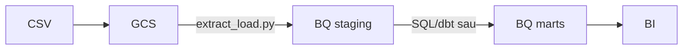

# Quy trình DE + BigQuery (tư duy + thứ tự làm)

**Mục lục học:** [`README.md`](README.md)

---

## 1. Bốn ý cốt lõi

| Ý | Một câu |
|---|--------|
| Warehouse | Tập trung dữ liệu để **SQL / BI**; tối ưu **đọc**, cần **grain** rõ (1 dòng = gì). |
| ELT trên BQ | Transform nặng nên làm **trong BQ (SQL/dbt)**; Python chỉ **kéo file + chuẩn hóa nhẹ**. |
| Tầng | **Raw/file** → **staging** (typed, sạch nhẹ) → **marts** (fact/dim). |
| Grain | Cùng KPI “doanh thu”: phải nói được **một bảng fact** và **một grain**; Olist: xem [`dwh-olist-design.md`](dwh-olist-design.md). |

---

## 2. Luồng demo trong repo

---

## 3. Demo vs production

| | Demo Olist | Production / big data |
|---|------------|------------------------|
| Load | pandas → `load_table_from_dataframe` | BQ Load Job, partition, incremental |
| Transform | notebook + sắp tới dbt | dbt + test + review |
| Orchestration | chạy tay | Scheduler / Composer / CI |

---

## 4. Checklist thực hành (tick lần lượt)

1. **EDA** — [`eda-summary.md`](eda-summary.md) + `notebooks/01_explore.ipynb`  
2. **ERD** — [`olist-schema.md`](olist-schema.md)  
3. **Star schema** — [`dwh-olist-design.md`](dwh-olist-design.md)  
4. **GCS** — [`d1.md`](d1.md), 9 file trong `raw/olist/`  
5. **Staging BQ** — `pipeline/extract_load.py` → verify `bq ls staging`  
6. **Chuẩn staging đủ** — [`staging-after-eda.md`](staging-after-eda.md)  
7. **Marts** — dbt hoặc `bq query` (chưa có trong repo)  
8. *(Tuỳ)* Lịch chạy job + test chất lượng  

---

## 5. Tự kiểm (không mở tài liệu)

1. Vì sao cần **staging**?  
2. `fact_order_items` vs `fact_orders` khác **grain** thế nào?  
3. ELT: phần nặng transform nên ở **đâu**?  
4. Data lớn gấp 1000 lần: đổi **công cụ load** gì trước?
