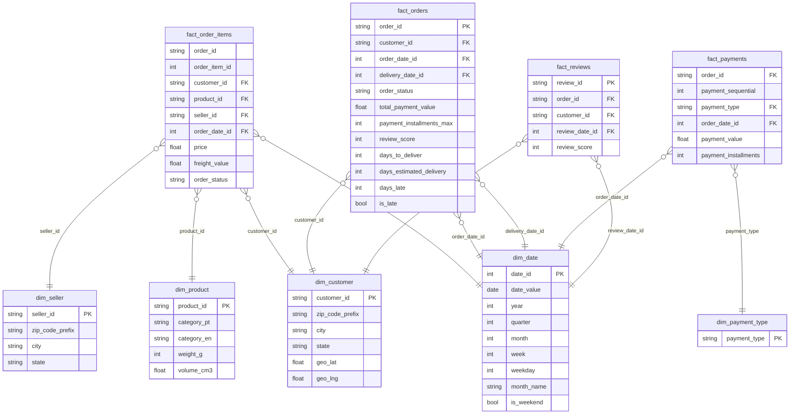

# Star schema — Olist (marts)

**Mục lục:** [`README.md`](README.md) · **ERD nguồn (CSV):** [`olist-schema.md`](olist-schema.md)

---

## 1. Grain (trước khi đọc sơ đồ)

| Fact | Grain (1 dòng =) | Ghi chú |
|------|------------------|---------|
| **fact_order_items** | 1 `order_id` + `order_item_id` | Fact giao dịch chính: doanh thu dòng hàng, phí ship dòng. |
| **fact_orders** | 1 `order_id` | Chỉ số cấp đơn: trạng thái, SLA giao hàng, tổng thanh toán (rollup), điểm review (nếu 1 review/đơn hoặc chọn rule). |
| **fact_payments** (tuỳ chọn) | 1 `order_id` + `payment_sequential` | Phân tích theo loại thanh toán / trả góp. |
| **fact_reviews** (tuỳ chọn) | 1 `review_id` | Phân tích nội dung/score review. |

**Không** nhét `product_id` / `seller_id` vào `fact_orders` nếu grain là đơn — sẽ **trùng lặp** hoặc mất chi tiết; giữ ở `fact_order_items`.

---

## 2. Star schema — Mermaid



`fact_orders` nối `dim_date` hai lần (mua vs giao) — hai cột `order_date_id`, `delivery_date_id`.

---

## 3. Cột chính (BigQuery-style)

### fact_order_items

| Cột | Kiểu | Mô tả |
|-----|------|--------|
| order_item_sk | INT64 | Surrogate key (tuỳ chọn, khuyến nghị SCD2 sau này). |
| order_id | STRING | Natural key + order_item_id. |
| order_item_id | INT64 | |
| customer_id | STRING | FK → dim_customer. |
| product_id | STRING | FK → dim_product. |
| seller_id | STRING | FK → dim_seller. |
| order_date_id | INT64 | FK → dim_date (từ `order_purchase_timestamp`). |
| price | FLOAT64 | |
| freight_value | FLOAT64 | |
| order_status | STRING | Degenerate (copy từ orders để filter không cần join staging). |

### fact_orders

| Cột | Kiểu | Mô tả |
|-----|------|--------|
| order_id | STRING | PK. |
| customer_id | STRING | FK → dim_customer. |
| order_date_id | INT64 | FK → dim_date. |
| delivery_date_id | INT64 | FK → dim_date (từ `order_delivered_customer_date`, nullable). |
| order_status | STRING | |
| total_payment_value | FLOAT64 | SUM(payments.payment_value) theo order. |
| payment_installments_max | INT64 | MAX installments (hoặc tách fact_payments). |
| review_score | INT64 | Rule: 1 review/đơn hoặc AVG nếu nhiều. |
| days_to_deliver | INT64 | delivered_customer − purchase (ngày). |
| days_estimated_delivery | INT64 | estimated − purchase. |
| days_late | INT64 | delivered − estimated (âm = giao sớm). |
| is_late | BOOL | delivered > estimated. |

### fact_payments (optional)

| Cột | Kiểu |
|-----|------|
| order_id, payment_sequential | |
| payment_type | FK → dim_payment_type |
| payment_value, payment_installments | |
| order_date_id | FK → dim_date |

### fact_reviews (optional)

| Cột | Kiểu |
|-----|------|
| review_id | PK |
| order_id, customer_id | FK |
| review_date_id | FK → dim_date |
| review_score | |

### dim_customer

| Cột | Kiểu | Nguồn |
|-----|------|--------|
| customer_id | STRING | customers |
| zip_code_prefix | STRING | Chuẩn hóa 5 ký tự |
| city, state | STRING | |
| geo_lat, geo_lng | FLOAT64 | Join `geolocation_by_zip_prefix` (median) |

### dim_product

| Cột | Kiểu | Nguồn |
|-----|------|--------|
| product_id | STRING | products |
| category_pt | STRING | product_category_name |
| category_en | STRING | translation |
| weight_g | INT64 | |
| volume_cm3 | FLOAT64 | length × height × width |

### dim_seller

| Cột | Kiểu | Nguồn |
|-----|------|--------|
| seller_id | STRING | sellers + zip chuẩn hóa, optional geo |

### dim_date

Bảng lịch: `date_id` = `YYYYMMDD` (INT64), các cột calendar (năm, quý, tháng, tuần, weekday, weekend flag).

### dim_payment_type

Các giá trị: boleto, credit_card, debit_card, voucher, not_defined.

---

## 4. DBML ([dbdiagram.io](https://dbdiagram.io))

```dbml
Table fact_order_items {
  order_id varchar
  order_item_id int
  customer_id varchar [ref: > dim_customer.customer_id]
  product_id varchar [ref: > dim_product.product_id]
  seller_id varchar [ref: > dim_seller.seller_id]
  order_date_id int [ref: > dim_date.date_id]
  price decimal
  freight_value decimal
  order_status varchar

  indexes {
    (order_id, order_item_id) [pk]
  }
}

Table fact_orders {
  order_id varchar [pk]
  customer_id varchar [ref: > dim_customer.customer_id]
  order_date_id int [ref: > dim_date.date_id]
  delivery_date_id int [ref: > dim_date.date_id, note: 'nullable']
  order_status varchar
  total_payment_value decimal
  payment_installments_max int
  review_score int
  days_to_deliver int
  days_estimated_delivery int
  days_late int
  is_late boolean
}

Table fact_payments {
  order_id varchar
  payment_sequential int
  payment_type varchar [ref: > dim_payment_type.payment_type]
  order_date_id int [ref: > dim_date.date_id]
  payment_value decimal
  payment_installments int

  indexes {
    (order_id, payment_sequential) [pk]
  }
}

Table fact_reviews {
  review_id varchar [pk]
  order_id varchar
  customer_id varchar [ref: > dim_customer.customer_id]
  review_date_id int [ref: > dim_date.date_id]
  review_score int
}

Table dim_customer {
  customer_id varchar [pk]
  zip_code_prefix varchar
  city varchar
  state varchar
  geo_lat decimal
  geo_lng decimal
}

Table dim_product {
  product_id varchar [pk]
  category_pt varchar
  category_en varchar
  weight_g int
  volume_cm3 decimal
}

Table dim_seller {
  seller_id varchar [pk]
  zip_code_prefix varchar
  city varchar
  state varchar
}

Table dim_date {
  date_id int [pk]
  date_value date
  year int
  quarter int
  month int
  week int
  weekday int
  month_name varchar
  is_weekend boolean
}

Table dim_payment_type {
  payment_type varchar [pk]
}
```

---

## 5. Raw / staging → marts

| Raw / staging | Mart |
|---------------|------|
| order_items + orders | fact_order_items |
| orders + payments (+ reviews rule) | fact_orders |
| payments | fact_payments |
| reviews | fact_reviews |
| customers + geo_agg | dim_customer |
| products + translation | dim_product |
| sellers | dim_seller |
| Calendar từ min/max timestamp | dim_date |
| DISTINCT payment_type | dim_payment_type |

Pipeline gợi ý: `raw` (mirror CSV) → `staging` (clean, join translation, geo_agg) → `marts` (facts + dims) bằng SQL/dbt trên BigQuery.
