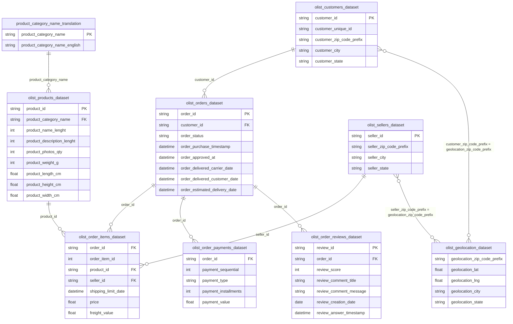

# ERD nguồn — Olist (CSV)

**Mục lục:** [`README.md`](README.md) · **Star schema / marts:** [`dwh-olist-design.md`](dwh-olist-design.md)

File thực tế: `olist_*_dataset.csv` + `product_category_name_translation.csv`. Tên `olist_customers_dataset` (không phải `olist_order_customer_dataset`).

## Mermaid



- Trục join: **orders** → items / payments / reviews / customers.  
- **Geo:** nhiều dòng / zip prefix — join lỏng hoặc aggregate trước.  
- **Typo cột:** `product_name_lenght` (Kaggle).

## DBML (dbdiagram.io)

```dbml
Table olist_orders_dataset {
  order_id varchar [pk]
  customer_id varchar [ref: > olist_customers_dataset.customer_id]
  order_status varchar
  order_purchase_timestamp datetime
  order_approved_at datetime
  order_delivered_carrier_date datetime
  order_delivered_customer_date datetime
  order_estimated_delivery_date datetime
}

Table olist_customers_dataset {
  customer_id varchar [pk]
  customer_unique_id varchar
  customer_zip_code_prefix varchar
  customer_city varchar
  customer_state varchar
}

Table olist_order_items_dataset {
  order_id varchar [ref: > olist_orders_dataset.order_id]
  order_item_id int
  product_id varchar [ref: > olist_products_dataset.product_id]
  seller_id varchar [ref: > olist_sellers_dataset.seller_id]
  shipping_limit_date datetime
  price decimal
  freight_value decimal
}

Table olist_order_payments_dataset {
  order_id varchar [ref: > olist_orders_dataset.order_id]
  payment_sequential int
  payment_type varchar
  payment_installments int
  payment_value decimal
}

Table olist_order_reviews_dataset {
  review_id varchar [pk]
  order_id varchar [ref: > olist_orders_dataset.order_id]
  review_score int
  review_comment_title varchar
  review_comment_message varchar
  review_creation_date date
  review_answer_timestamp datetime
}

Table olist_products_dataset {
  product_id varchar [pk]
  product_category_name varchar [ref: > product_category_name_translation.product_category_name]
  product_name_lenght int
  product_description_lenght int
  product_photos_qty int
  product_weight_g int
  product_length_cm decimal
  product_height_cm decimal
  product_width_cm decimal
}

Table olist_sellers_dataset {
  seller_id varchar [pk]
  seller_zip_code_prefix varchar
  seller_city varchar
  seller_state varchar
}

Table olist_geolocation_dataset {
  geolocation_zip_code_prefix varchar
  geolocation_lat decimal
  geolocation_lng decimal
  geolocation_city varchar
  geolocation_state varchar
}

Table product_category_name_translation {
  product_category_name varchar [pk]
  product_category_name_english varchar
}
```

Join geo qua zip: FK lỏng — thể hiện bằng comment hoặc SQL, không bắt buộc trong DBML.
